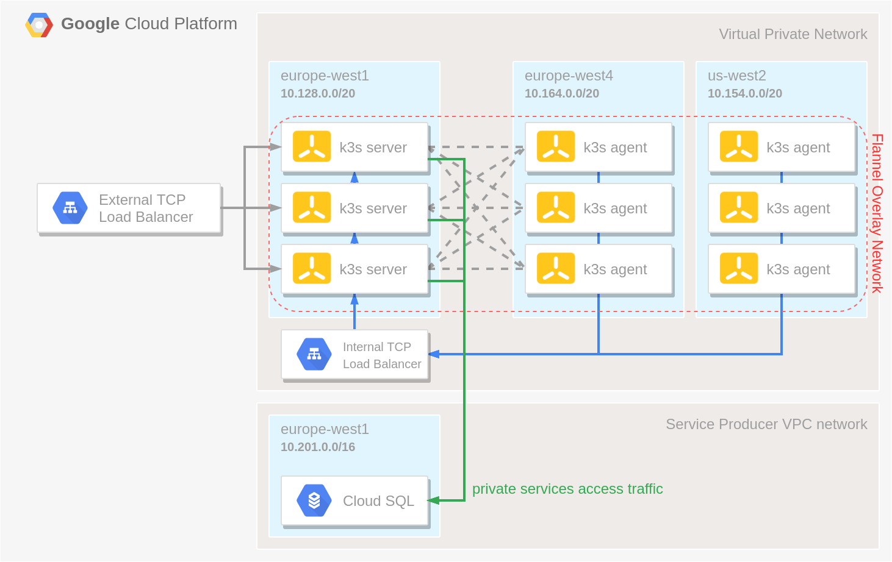

# Multi Region k3s cluster on GCP

A HA k3s cluster build with:

- a [Cloud SQL](https://cloud.google.com/sql) instance of an external datastore
- a [Managed Instance Group](https://cloud.google.com/compute/docs/instance-groups) of server nodes that will serve the Kubernetes API and run other control plane services
- multiple [Managed Instance Groups](https://cloud.google.com/compute/docs/instance-groups) of agent nodes that will run our apps, spread across multiple regions
- an [Internal TCP Load Balancer](https://cloud.google.com/load-balancing/docs/internal) in front of the server nodes to allow the agent nodes to register with the cluster
- an [External TCP Load Balancer](https://cloud.google.com/load-balancing/docs/network) to expose to API server to allow interaction with the cluster using e.g. `kubectl`

